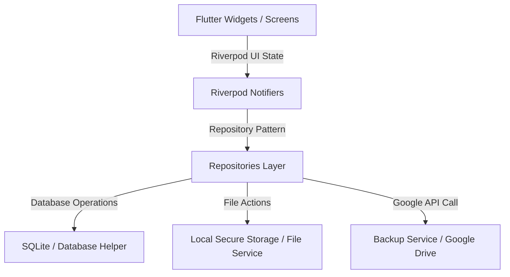

# 🩺 Open Cloud Health

[](https://flutter.dev)
[](https://dart.dev)
[](https://localfirstweb.dev/)
[](https://pub.dev/packages/local_auth)
[](https://developers.google.com/drive)

Open Cloud Health is a cross-platform, local-first personal health tracking application built with Flutter. It empowers users to own and manage their medical data privately, without relying on a centralized, proprietary backend server.

---

## 🎨 Core Philosophy

*   **Privacy First:** All health data (profiles, history, medications, allergies, and vitals) is stored locally on the device using an encrypted SQLite database (`SQLCipher with Drift`). No data is sent to third-party servers.
*   **Biometric Security:** The app is gated by native biometric authentication (`local_auth`) upon launch, ensuring data remains secure even if the device is unlocked.
*   **User-Owned Cloud Sync:** Instead of using a central server, the app backs up the SQLite database and profile images directly to a hidden "App Data" folder in the user's personal Google Drive. This utilizes Google's `driveAppdataScope`, adhering to non-sensitive API policies for seamless, secure device migration without exposing files in the main Google Drive UI.

---

## ✨ Features

### 👤 Profile Management
*   **Multi-Profile Support:** Manage health records for multiple family members or profiles in a single app.
*   **Custom Attributes:** Name, Date of Birth, Gender, Blood Type, Organ Donor status, and custom Profile Pictures via `image_picker`.

### 🌸 Period & Cycle Tracker
*   **Comprehensive Logging:** Log flow intensity, mood, physical symptoms (cramps, headaches, acne, etc.), and custom notes.
*   **Cycle Predictions:** Visual calendars built with `table_calendar` showing historical cycles and future predictions.
*   **Interactive Insights:** Rich symptom frequency analysis and flow charts.

### 💊 Medication Tracker
*   **Dashboard & Daily Schedules:** Keep track of active medications, dosages, and frequencies.
*   **Dose Logging:** Maintain logs of precisely when a dose was taken or missed.
*   **Reminders:** Native local push notifications (`flutter_local_notifications` and `timezone` configuration) scheduled dynamically to remind users to take their medications.

### 📊 Vitals & Measurements
*   **Chronic & General Logging:** Log quantitative health data over time, including Blood Pressure (Systolic/Diastolic), Weight, and Blood Sugar.
*   **Visual Trends:** Graphical representations of logged vitals using custom dynamic charts via `fl_chart`.

### 📋 Medical History Timeline
*   **Log Events:** Capture doctor visits, diagnoses, surgeries, and custom health events.
*   **File Attachments:** Link files, receipts, or prescription PDFs to specific history events, handled securely using local path storage (`path_provider`, `file_picker`, and `open_file_plus`).

### 🩺 Appointments & Checkups
*   **Reminder for Appointments:** Show appointments you should be doing based on your medical info.

---

## 🏗️ Architectural Design

Open Cloud Health is built on clean architecture patterns designed to scale and remain testable:



### Key Technical Details
1.  **Repository Pattern:** UI screens and Riverpod state managers (`Notifiers` / `AsyncNotifiers`) never make raw database calls. Instead, they interact with dedicated repositories (e.g., `MedicationsRepository`, `ProfilesRepository`) which abstract local SQLite database operations.
2.  **State Management:** State is managed via `flutter_riverpod`. High-level controllers fetch data asynchronously, and UI pages respond gracefully to `AsyncValue` data, loading, and error states.
3.  **Local Database:** Powered by `drift` with typed tables, reactive stream queries, relational integrity constraints, and transactional safety.
4.  **Local Notifications:** Dynamic notification scheduling utilizing timezone awareness so alerts trigger correctly matching the user's native device clock.
5.  **Biometric Lock:** Standard local auth check runs on app resume and initial startup to gate app access behind TouchID, FaceID, or PIN checks.

---

## 🛠️ Project Structure

```text
lib/
├── database/        # Drift database schema, tables, and AppDatabase
├── models/          # Dart entity data models (Profile, Medication, Allergy, etc.)
├── providers/       # State management providers utilizing Riverpod
├── repositories/    # Abstract and concrete reactive database repositories
├── routing/         # Declarative routing and screen navigation via GoRouter
├── screens/         # Screens and Page widgets representing full layouts
├── services/        # Low-level native utilities (Backup, Notifications, File IO)
├── storage/         # Local secure key-value and preferences management
├── utils/           # Shared helper functions, formatters, and style extensions
└── widgets/         # Domain-specific and global reusable UI components
```

---

## 📦 Core Dependencies

Here is a list of the key packages powering Open Cloud Health:

| Package | Purpose | Category |
| :--- | :--- | :--- |
| `drift` | Typed, reactive SQLite database engine | Storage |
| `flutter_riverpod` | Decoupled reactive state management | Architecture |
| `go_router` | Declarative routing and deep linking | Routing |
| `local_auth` | Biometric authentication (FaceID, TouchID, PIN) | Security |
| `fl_chart` | Data visualization and vitals tracking charts | UI |
| `flutter_local_notifications` | Timed medication reminders and notifications | Background |
| `google_sign_in` | User authentication for cloud sync access | Sync |
| `googleapis` | Connects directly to personal Google Drive folders | Sync |
| `flutter_secure_storage` | Safely saves encryption and auth keys locally | Security |
| `table_calendar` | Visual menstrual cycle calendar grids | UI |

---

## 🚀 Getting Started

### Prerequisites
Make sure your system meets the standard Flutter development requirements:
*   [Flutter SDK](https://docs.flutter.dev/get-started/install) (`>= 3.2.3`)
*   [Dart SDK](https://dart.dev/get-started) (`>= 3.2.3`)
*   **Android:** Android SDK, Android Studio, Gradle, and a test device/emulator.
*   **iOS/macOS:** macOS system, Xcode, CocoaPods installed.

### Setup Instructions
1.  **Clone the Repository**
    ```bash
    git clone https://github.com/your-username/open-cloud-health.git
    cd open-cloud-health
    ```

2.  **Install Dependencies**
    ```bash
    flutter pub get
    ```

3.  **Run Development Assets Builders** (Optional, if editing app launch splash or app launcher icons)
    *   To rebuild the native launcher icons:
        ```bash
        flutter pub run flutter_launcher_icons
        ```
    *   To rebuild the native splash screens:
        ```bash
        flutter pub run flutter_native_splash:create
        ```

4.  **Run the Application**
    *   Run in debug mode on your connected simulator, emulator, or physical device:
        ```bash
        flutter run
        ```

---

## 🧪 Testing

Open Cloud Health has tests to verify data parsing, repository layers, state flows, and notification scheduling.

*   To run the automated tests, execute:
    ```bash
    flutter test
    ```
*   To check static code analysis and linting:
    ```bash
    flutter analyze
    ```

---

## 🛡️ Privacy & Security Architecture

Because health data is highly sensitive, Open Cloud Health was designed with an explicitly defined boundary:

1.  **No Centralized Databases:** We do not host your data. Even the cloud synchronization mechanism targets the user's *own* personal cloud account, and files are stored in a private directory visible only to the Open Cloud Health application.
2.  **On-Device Biometric Lock:** At startup, if enabled, a native security overlay prevents any UI elements from mounting until the user successfully completes a biometric handshake.
3.  **Encrypted Configurations:** Any sensitive tokens or sync keys are stored within the platform's secure hardware enclave (Keychain on iOS, Keystore on Android) using `flutter_secure_storage`.
